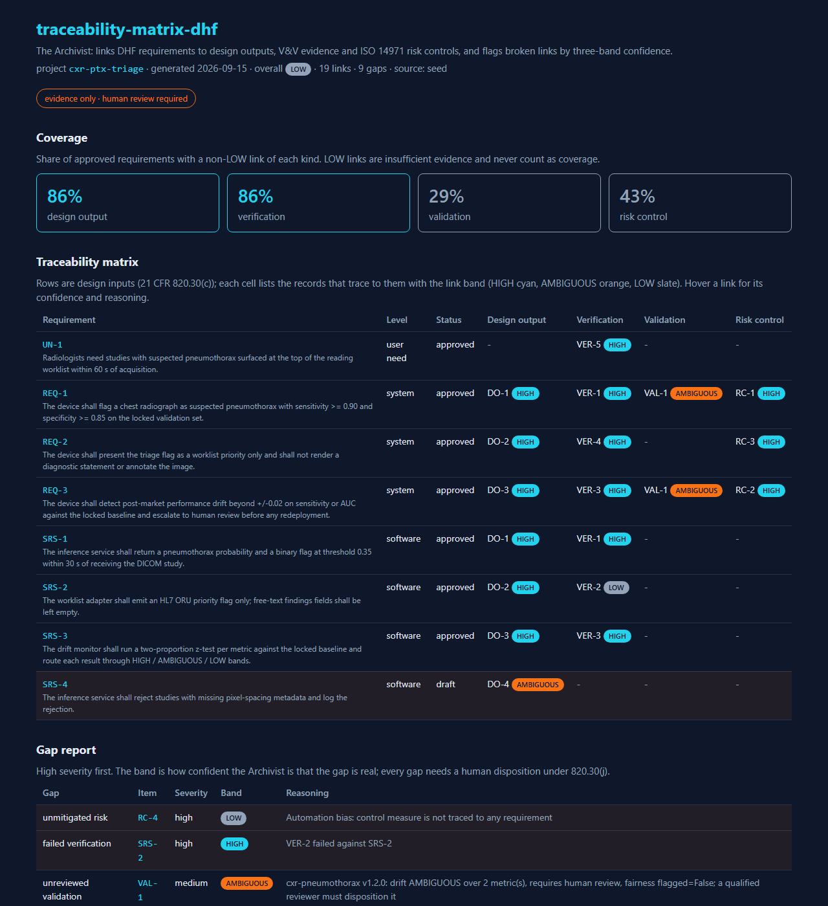
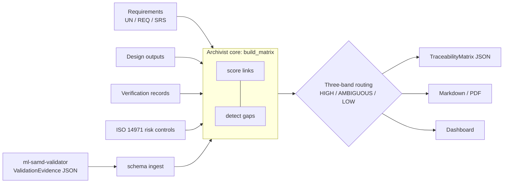

# traceability-matrix-dhf

[](https://github.com/LSaiko/traceability-matrix-dhf/actions/workflows/ci.yml)
[](https://github.com/LSaiko/traceability-matrix-dhf/actions/workflows/pages.yml)
[](pyproject.toml)
[](https://docs.pydantic.dev/latest/)
[](.github/workflows/ci.yml)
[](https://www.ecfr.gov/current/title-21/chapter-I/subchapter-H/part-820/subpart-C/section-820.30)
[](LICENSE)
[](https://LSaiko.github.io/traceability-matrix-dhf/)

**Design-controls traceability for FDA-regulated ML: links every requirement in a Design
History File to its design output, test, validation evidence and risk control, and reports
where the chain is broken.**

A medical device is not cleared because its software works; it is cleared because the
manufacturer can show, record by record, that every requirement was designed, tested,
validated and risk-controlled. FDA design controls (21 CFR 820.30) make that chain a legal
obligation and the Design History File (DHF) the place it lives. The artifact an auditor asks
for first is the traceability matrix: requirement in the rows, evidence in the columns, no
empty cells. For a machine-learning device the matrix has a moving part that a spreadsheet
cannot hold: the validation evidence changes after shipment because the model's performance
drifts. This tool keeps the matrix live. It ingests `ValidationEvidence` packages exported by
[ml-samd-validator](https://github.com/LSaiko/ml-samd-validator), scores every trace link with
an explicit confidence band, and hands each gap to a human reviewer with the reasoning attached.
Its role is the Archivist: it keeps the record and reports the gaps, it never closes one on
its own.

## Contents

- [Core use case](#core-use-case)
- [What it does](#what-it-does)
- [Architecture](#architecture)
- [Setup](#setup)
- [API](#api)
- [Regulatory framing](#regulatory-framing)
- [Interview talking points](#interview-talking-points)
- [Related projects](#related-projects)
- [Interview Q&A](#interview-qa)
- [License](#license)

## Core use case

A manufacturer is preparing a 510(k) for a chest-X-ray pneumothorax triage model (FDA SaMD
class II, IEC 62304 class B). The DHF holds eight requirements (a user need, three system
requirements, four software requirements), four design outputs, five verification records and
four ISO 14971 risk controls. The regulatory lead needs the traceability matrix for the
submission and, six months after launch, will need it again for the post-market audit.

1. **Load the DHF.** `POST /project` with the `DhfProject`, or `POST /project/{id}/items` one
   record at a time. Records link by explicit id: a design output lists the `requirement_ids`
   it implements, a verification record the ids it verifies, a risk control the ids that
   implement its control measure.
2. **Ingest live validation evidence.** The monitoring pipeline runs ml-samd-validator each
   quarter and exports a `ValidationEvidence` JSON carrying `evidence_id`, `requirement_ids`
   and a drift verdict with its own confidence band. `POST /project/{id}/evidence` validates
   it against the shared schema, stores it verbatim as `VAL-n`, and creates a `validates` link
   to each requirement it names. The link's confidence follows the exporter's drift band: a
   HIGH-band package with no review flag is a HIGH link; an AMBIGUOUS package that asks for
   human review is a 0.55 link: still AMBIGUOUS, still counted, but raised as an
   `unreviewed_validation` gap until a reviewer dispositions it.
3. **Find the gaps.** `GET /project/{id}/matrix` returns the scored matrix; `GET
   /project/{id}/gaps` returns just the gap list, high severity first. In the seeded demo
   the tool finds: a risk control for automation bias with no requirement behind it (high,
   ISO 14971 §7.2), an HL7 integration test that failed against its software requirement
   (high, 820.30(f)), the AMBIGUOUS validation package awaiting review (medium), a user need
   with no design output, and five requirements with no validation evidence at all. One
   design-output link is only AMBIGUOUS because its target requirement is still a draft.
4. **Hand it to a human.** `?format=markdown` renders the matrix, gap table and IEC 62304 /
   ISO 14971 notes for the DHF; the dashboard shows the same data with band colours. Every gap
   carries the Archivist's reasoning and the band expressing how sure it is that the gap is
   real. The disposition is the reviewer's.

## What it does

- Holds a `DhfProject`: requirements (user need / system / software, each with an IEC 62304
  class and approval status), design outputs, verification records, validation evidence and
  ISO 14971 risk controls, all Pydantic v2 with `extra="forbid"`.
- Ingests `ValidationEvidence` JSON from ml-samd-validator against a byte-identical copy of its
  schema (`schemas/validation-evidence.schema.json`) and stores the package verbatim so the
  matrix export is self-contained for an auditor.
- Builds the requirements traceability matrix: `implements`, `verifies`, `validates` and
  `mitigates` links, each with a 0-1 confidence, a HIGH / AMBIGUOUS / LOW band and a one-line
  reasoning.
- Detects eight gap kinds (missing design output / verification / validation, failed
  verification, unmitigated risk, orphan design output, orphan evidence, unreviewed
  validation) with severity and band, and reports per-kind coverage over approved requirements
  counting only non-LOW links.
- Renders the matrix as Markdown, PDF and a versioned JSON export
  (`docs/traceability-matrix.schema.json`).
- React dashboard: coverage tiles, the matrix, the gap report and the validation evidence log;
  runs in seed mode with no backend for the GitHub Pages demo.
- Every report carries IEC 62304 and ISO 14971 language and the disclaimer that it is evidence
  for a human reviewer, not a release decision.

[](https://LSaiko.github.io/traceability-matrix-dhf/)

_Click the screenshot to open the live demo (seeded with synthetic data, no backend required)._

## Architecture



Band definitions, the confidence table and the standards mapping:
[docs/architecture.md](docs/architecture.md). Contracts:
[docs/traceability-matrix-schema.md](docs/traceability-matrix-schema.md).

## Setup

```bash
# backend (Python >= 3.12)
pip install -e .[dev]
uvicorn app.main:app --reload          # http://127.0.0.1:8000/docs

# dashboard (Node 22)
cd dashboard && npm ci && npm run dev  # seed mode unless VITE_API_BASE is set

# checks (what CI runs)
ruff check . && mypy app schemas && pytest --cov=app --cov=schemas --cov-branch
cd dashboard && npx tsc --noEmit && npm run build
```

| Env var | Where | Purpose |
|---|---|---|
| `ALLOWED_ORIGINS` | backend | Comma-separated CORS origins (default `*`) |
| `VITE_API_BASE` | dashboard | Backend URL; unset = built-in seed matrix |
| `VITE_PROJECT_ID` | dashboard | Project to display (default: seed project) |
| `VITE_BASE` | dashboard build | URL subpath, e.g. `/traceability-matrix-dhf/` for Pages |

## API

| Method | Path | Body / query | Returns |
|---|---|---|---|
| GET | `/health` | | `{"status": "ok"}` |
| POST | `/project` | `DhfProject` | stored project (upsert by `project_id`) |
| GET | `/project/{id}` | | `DhfProject` |
| POST | `/project/{id}/items` | `Requirement` / `DesignOutput` / `VerificationRecord` / `RiskControl` (type from id prefix) | stored item (upsert by id) |
| POST | `/project/{id}/evidence` | raw `ValidationEvidence` JSON from ml-samd-validator | `ValidationEvidenceRecord` as `VAL-n`; 400 with the schema error if rejected |
| GET | `/project/{id}/matrix` | `?format=json\|markdown` | `TraceabilityMatrix` or Markdown report |
| GET | `/project/{id}/gaps` | | `{overall_band, gaps[]}` |

Unknown project ids return 404. The store is in-memory (`# ponytail:` note in `app/main.py`).

## Regulatory framing

- **21 CFR 820.30(j)**: the DHF must demonstrate that the design was developed under the
  design-control plan. The matrix maps (c) design inputs to (d) design outputs, (f)
  verification and (g) validation, and every gap kind names the subsection it violates.
- **IEC 62304 §5.1.1 / §5.2 / §5.7**: the software development plan must establish traceability
  from system requirements to software requirements, system tests and risk control measures.
  Requirements carry a level (user need / system / software) and a safety class; for class B
  and C the matrix is release-blocking evidence, for class A each gap still needs a disposition.
- **ISO 14971 §7**: each hazard needs a control measure (§7.1) implemented as a requirement
  (§7.2) whose effectiveness is verified (§7.3). A control with no known requirement or no
  passing verification is an `unmitigated_risk` gap. Residual-risk acceptability (§7.4, §8) is
  the manufacturer's statement; the tool records it and never asserts it.
- **Three-band routing on link quality.** An explicit id match to an approved requirement is
  0.90 (HIGH); a draft target costs 0.15, an obsolete one 0.30; a failed verification is 0.20
  and a blocked one 0.50; a validation link takes the exporter's own drift band (0.90 / 0.65 /
  0.40) minus 0.10 if it asked for human review; a link to an id that does not exist is 0.10.
  HIGH (>= 0.80) passes through, AMBIGUOUS (0.55-0.79) is flagged for human interpretation
  with the reasoning attached, LOW (< 0.55) is insufficient evidence and never counts as
  coverage. The matrix's overall band is the worst band present.
- **Archivist disclaimer**: the tool does not author requirements, does not invent or fabricate
  evidence, and never closes a gap. It produces the matrix, scores the links and flags the gaps.

## Interview talking points

**Why the traceability matrix is the artifact auditors ask for.** Design controls are a
process regulation: the FDA does not certify the device, it verifies that the manufacturer
followed a controlled process from need to release. The matrix is the one document that shows
the whole process at once, and its empty cells are the findings. An investigator can pick any
requirement and walk to the code that implements it, the test that passed, the validation
that proved it meets the user need and the hazard it controls. If any of those steps is
missing, the DHF cannot support the claim; if any is present but unrecorded, it does not
exist for regulatory purposes. Keeping the matrix as a generated artifact over structured
records, rather than a hand-maintained spreadsheet, means the gaps are found by the tool
instead of by the auditor.

**Why link confidence is not binary.** A trace link is a claim that evidence supports a
requirement, and claims come with different amounts of support. A passing test against an
approved requirement is a strong link. The same test against a requirement still in draft is
a link to something that is not yet a design input under 820.30(c). A validation package from
a drift monitor that itself says "AMBIGUOUS, needs human review" cannot be a HIGH link
without laundering the exporter's own uncertainty. Three bands let the tool pass through the
strong links, hand the middle ones to a reviewer with the reason, and refuse to count weak
ones as coverage. The alternative, a binary "linked / not linked", either overstates coverage
or forces every uncertainty into a gap and buries the real ones.

**One concrete trade-off: explicit ids vs semantic matching.** Links come only from explicit
`requirement_ids` on each record; the tool never infers that DO-3 implements REQ-3 because
their descriptions both mention drift. What that gives up: an NLP or embedding matcher would
surface links the author forgot to record and catch typos in ids, and it would make the tool
useful on a DHF that was never structured for traceability. What it keeps: every link is
deterministic and reproducible, the reasoning is one line an auditor can check, and the
confidence has a documented meaning (status of the target, result of the test, band of the
evidence) instead of a cosine similarity that nobody can defend in an inspection. In a design
history file the cost of a fabricated link is higher than the cost of a missed one, and a
missed link surfaces as a gap for a human to fix, which is the workflow the regulation wants.

## Related projects

- [ml-samd-validator](https://github.com/LSaiko/ml-samd-validator): the Inspector. Produces
  the `ValidationEvidence` JSON this tool ingests (drift, PCCP and subgroup fairness evidence
  with three-band confidence).
- [SaMD-Val-Kit](https://github.com/LSaiko/SaMD-Val-Kit): validation protocol templates and
  V&V planning for SaMD.
- [part11-audit-trail](https://github.com/LSaiko/part11-audit-trail)
  ([live demo](https://lsaiko.github.io/part11-audit-trail/)): the Documenter. Hash-chained,
  append-only audit log and Ed25519 e-signatures (21 CFR Part 11, ALCOA+); its audit records
  are consumable here as DHF evidence, and the traceability matrix itself is a signable record.

## Interview Q&A

**Why does a LOW link produce no coverage but also no "missing" gap?** Because they are two
different findings. A `missing_verification` gap says no record claims to verify the
requirement. A LOW `verifies` link says a record claims to but the evidence is inadequate: the
test failed, was blocked, or points at a requirement that no longer exists. The matrix shows
the link with its band and reasoning, the coverage figure excludes it, and the specific cause
gets its own gap (`failed_verification`, `orphan_evidence`). Collapsing the two would hide
which fix is needed.

**Why is an unreviewed validation package a gap when it is also a link?** ml-samd-validator
sets `requires_human_review` when its own drift or fairness findings are not HIGH. Under ISO
14971 the risk control for a flagged deviation is human review before any deployment
decision, so until a qualified reviewer dispositions the package the evidence has not
completed its own risk control. The tool records the link at a reduced confidence and raises
an `unreviewed_validation` gap (AMBIGUOUS band, because the Inspector itself said it was
uncertain) so the review shows up in the gap report rather than disappearing into a
coverage percentage.

**A risk control has a requirement but its verification failed. Is the risk mitigated?** No.
ISO 14971 §7.3 requires verification of the control's effectiveness, so `build_matrix` raises
`unmitigated_risk` when a control has no known requirement or no passing verification, with
high severity when severity x probability is 12 or more. In the seeded demo RC-4 (automation
bias) has no requirement at all and is the highest-ranked gap; a control whose only
verification failed would rank the same way.

**How would you take this from a portfolio project to a real DHF tool?** Persist the store
(the API is already keyed for it), add reviewer identity and a signed disposition log on every
gap so the matrix becomes tamper-evident, version each `TraceabilityMatrix` export against the
DHF revision it was generated from, and let `requirement_ids` on incoming evidence be checked
against the requirements' acceptance criteria rather than just their ids so the validation
link can say which criterion the evidence addresses.

## License

MIT, see [LICENSE](LICENSE).
