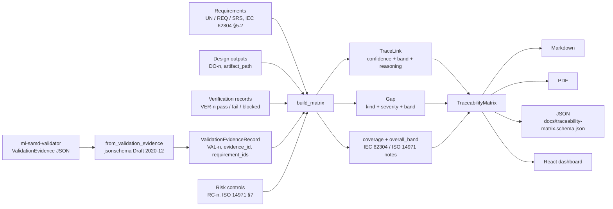

# Architecture

Part of [traceability-matrix-dhf](../README.md); see the README for setup and API.

`traceability-matrix-dhf` implements the Archivist role for a Software as a Medical Device
Design History File. Under FDA 21 CFR 820.30 the DHF must show that design inputs (c) were
implemented by design outputs (d), verified (f), validated (g) and that risk management ran
alongside (ISO 14971). The Archivist links those records, scores every link, and reports where
the chain is broken. It does not author requirements, does not invent or fabricate evidence,
and never closes a gap on its own: every gap is handed to a human with the reasoning attached.

Modules: `schemas/models.py` (Pydantic v2, `extra="forbid"`, ingestion validator),
`app/core.py` (`build_matrix`), `app/report.py` (Markdown, PDF, JSON export, schema
generation), `app/main.py` (FastAPI). Contracts are documented in
[traceability-matrix-schema.md](traceability-matrix-schema.md).

## Three-band confidence routing on link quality

Every `TraceLink` carries a confidence that the link is valid and the evidence behind it is
adequate. Confidence is heuristic and deliberately documented in `app/core.py` (`# ponytail:`
comments) rather than learned:

| Situation | Confidence | Band |
|---|---|---|
| explicit id match to an approved requirement | 0.90 | HIGH |
| target requirement is `draft` (not yet a design input under 820.30(c)) | -0.15 | AMBIGUOUS |
| target requirement is `obsolete` | -0.30 | AMBIGUOUS / LOW |
| verification `blocked` | 0.50 | LOW |
| verification `fail` ("failed verification does not evidence coverage") | 0.20 | LOW |
| validation evidence `overall_band` HIGH / AMBIGUOUS / LOW | 0.90 / 0.65 / 0.40 | same |
| validation evidence `requires_human_review` | -0.10 | |
| target id does not exist in the DHF | 0.10 | LOW + orphan gap |

| Band | Confidence | Routing |
|---|---|---|
| HIGH | >= 0.80 | pass-through; counted as coverage |
| AMBIGUOUS | 0.55-0.79 | flagged for human interpretation with reasoning; counted as coverage |
| LOW | < 0.55 | insufficient evidence; **not** counted as coverage, gap raised where applicable |

`overall_band` is the worst band across all links. Gap bands express how confident the
Archivist is that the gap is real: the best surviving link for the item, or LOW when nothing
exists. An `unreviewed_validation` gap is always AMBIGUOUS because the Inspector itself asked
for human review.

## IEC 62304 software lifecycle

IEC 62304 §5.1.1 requires the software development plan to establish traceability between
system requirements, software requirements, software system tests and risk control measures;
§5.2 (software requirements analysis) decomposes user needs into system and software
requirements (`RequirementLevel`), and §5.7 (software system testing) must show each
requirement was tested. For safety class B and C the matrix is release-blocking evidence; for
class A the documentation depth is relaxed but each gap still needs a disposition. The project's
class is stated on `DhfProject.iec_62304_class` and each requirement carries its own class so a
class C requirement inside a class B project is visible.

## ISO 14971 risk management

Each `RiskControl` records the hazard, hazardous situation and harm (§5), a severity x
probability index (§5.5), the control measure (§7.1), the requirements that implement it (§7.2)
and the verifications that show it is effective (§7.3). A control with no known requirement or
no passing verification is an `unmitigated_risk` gap, high severity when the index is >= 12.
`residual_risk_acceptable` is the manufacturer's statement (§7.4, §8); the Archivist reports it
and never asserts it.

## 21 CFR 820.30 mapping

| 820.30 | Record | Link kind | Gap when missing |
|---|---|---|---|
| (c) design input | `Requirement` | target of every link | - |
| (d) design output | `DesignOutput` | `implements` | `missing_design_output`, `orphan_design_output` |
| (f) design verification | `VerificationRecord` | `verifies` | `missing_verification`, `failed_verification` |
| (g) design validation | `ValidationEvidenceRecord` | `validates` | `missing_validation`, `unreviewed_validation` |
| ISO 14971 (referenced by (g) risk analysis) | `RiskControl` | `mitigates` | `unmitigated_risk` |
| (j) design history file | `TraceabilityMatrix` | - | the human disposition of every gap |

## Persistence and the design history record

`app/store.py` defines `TraceabilityStore` (`get` / `put` of a `DhfProject`). The server
injects `SqliteStore` (one file at `DHF_DB_PATH`, one table per record type, columns
mirroring the Pydantic fields) and the unit tests inject `InMemoryStore`. Only the design
inputs and evidence are stored. Links, confidence bands and gaps are recomputed on every read,
so a stored traceability claim cannot outlive the records behind it. That matters for IEC
62304 §5.1.1 and ISO 14971 §7.3, where the trace is only as good as the evidence it points to.
The store keeps current state only. It has no revision history and no locking for concurrent
writers, so it is not by itself a 21 CFR 820.30(j) / IEC 62304 §8 configuration-managed record
(README, Persistence).

## Sibling integration

`ml-samd-validator` (the Inspector) exports `ValidationEvidence` JSON with an `evidence_id`
and `requirement_ids`. This repository keeps a byte-identical copy of that schema in
`schemas/validation-evidence.schema.json`, validates each incoming package against it, and
turns it into `validates` links whose confidence follows the Inspector's own drift band. The
evidence package is stored verbatim in `ValidationEvidenceRecord.raw` so the matrix export is
self-contained for an auditor.
